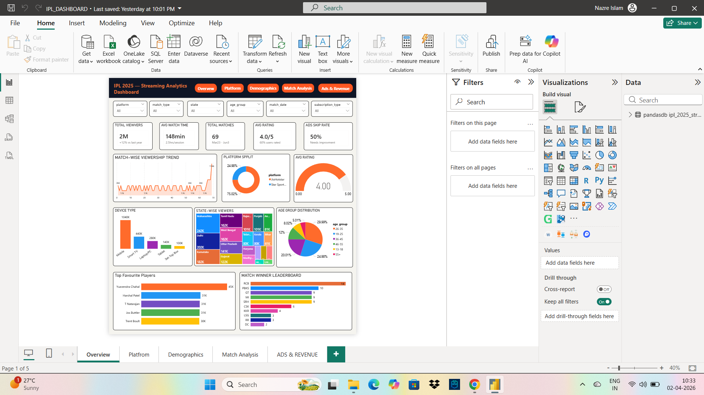
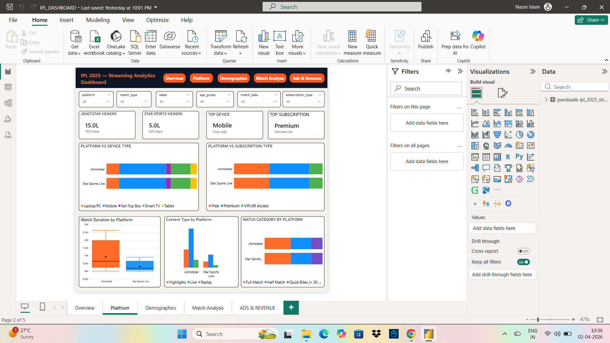
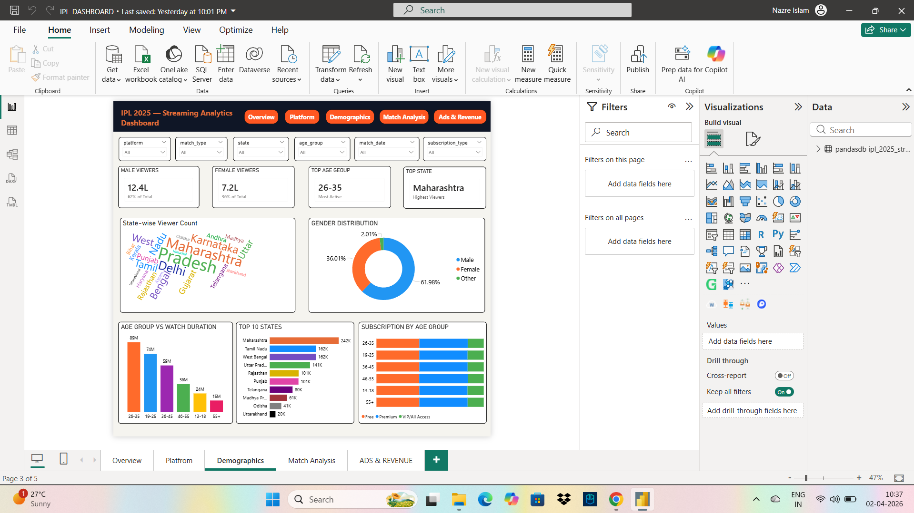
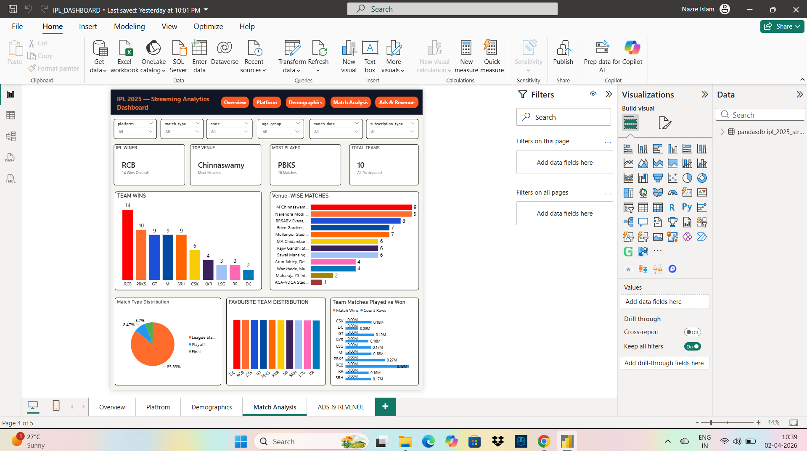
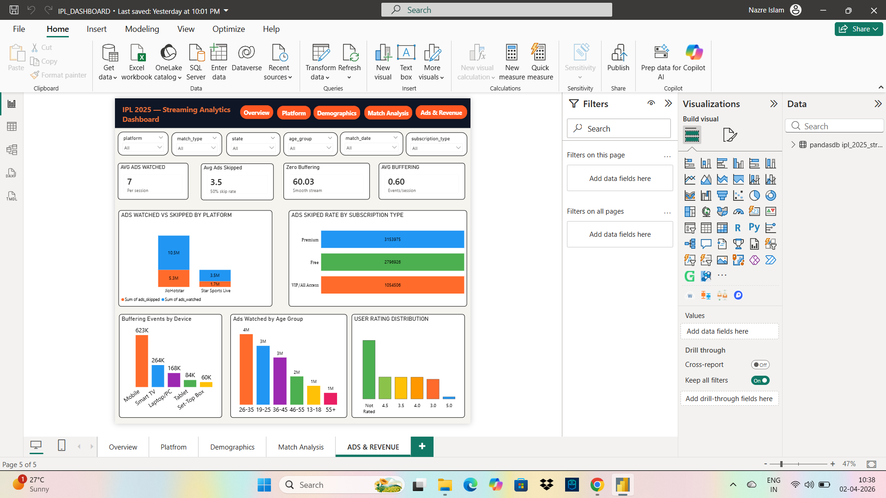

# 🏏 IPL 2025 Streaming Analytics



## 📌 Project Overview

This project analyzes IPL 2025 streaming viewership data with **20 lakh (2,000,000) rows** and **26 columns**. The dataset is AI-generated synthetic data based on the real IPL 2025 match schedule, created for showcasing data analysis skills and portfolio projects.

> ⚠️ **Note:** This is an AI Generated Synthetic Dataset created by Manish Sehrawat. Data is based on real IPL 2025 match schedule but viewer data is completely synthetic. Not for commercial use.

---

## 📁 Project Structure

```
IPL-2025-Streaming-Analytics/
│
├── 📁 ASSETS/                          # Dashboard Screenshots
│     ├── Overview_Page.png
│     ├── Platform_Page.png
│     ├── Demographics_Page.png
│     ├── Match_Analysis_Page.png
│     └── Ads_&_Revenue_Page.png
│
├── 📁 DASHBOARD/                       # Power BI Dashboard
│     └── (Dashboard available on Google Drive)
│
├── 📁 DATA/                            # Dataset Files
│     ├── 📁 ROW_DATA/
│     │     └── (Dataset available on Google Drive)
│     └── 📁 CLEANED_DATA/
│           └── (Cleaned Dataset available on Google Drive)
│
├── 📁 NOTEBOOK/                        # Jupyter Notebook
│     └── IPL.ipynb
│
└── README.md
```

---

## 📊 Dataset Details

| Property | Value |
|----------|-------|
| Total Rows | 20,00,000 (20 Lakh) |
| Total Columns | 26 |
| IPL Season | 2025 |
| Date Range | 22nd March 2025 — 3rd June 2025 |
| Total Matches | 69 |
| Total Teams | 10 |
| Total Venues | 12 |
| Total States | 20 |

### Columns
`viewer_id`, `session_id`, `match_no`, `match_date`, `team1`, `team2`, `match_type`, `venue`, `match_winner`, `viewer_name`, `phone_number`, `gender`, `age_group`, `state`, `platform`, `device_type`, `subscription_type`, `watch_category`, `content_type`, `watch_duration_mins`, `ads_watched`, `ads_skipped`, `buffering_events`, `favourite_team`, `favourite_player`, `user_rating`

---

## 📂 Dataset Download

Dataset is too large for GitHub (200MB+).

Download from Google Drive:
👉 [IPL_2025_STREAMING_DATA](YOUR_GOOGLE_DRIVE_LINK)
👉 [IPL_2025_STREAMING_CLEANED_DATA](YOUR_GOOGLE_DRIVE_LINK)

---

## 📊 Dashboard Download

Power BI Dashboard file is too large for GitHub (119MB+).

Download from Google Drive:
👉 [IPL_DASHBOARD.pbix](YOUR_GOOGLE_DRIVE_LINK)

---

## 🛠️ Tools Used

| Tool | Purpose |
|------|---------|
| Python (Pandas, Matplotlib, Seaborn) | Data Cleaning & EDA |
| MySQL | Database Storage |
| Power BI | Interactive Dashboard |
| Jupyter Notebook | Analysis & Visualization |

---

## 🔄 Project Steps

```
Step 1 → Dataset Creation (AI Generated)
Step 2 → Data Cleaning (Python)
Step 3 → EDA Report (Python)
Step 4 → MySQL Database Load
Step 5 → Power BI Dashboard
```

---

## 📈 Key Insights

### Viewing Behaviour
- Average watch duration: **148 mins (2.5 hours)**
- Majority viewers watched **165+ mins**
- **50%+ viewers** had zero buffering events
- Live streaming was the most preferred content type

### Platform & Device
- **JioHotstar** dominates with **72% share**
- **Mobile** is the most used device
- **Premium** subscription users are highest

### Demographics
- Most active age group: **26-35 years**
- Male viewers: **52%**, Female: **45%**
- Top state: **Maharashtra**
- Second state: **Delhi**

### Ads Performance
- Average ads watched: **7 per session**
- Average ads skipped: **3.5 per session**
- Ads skip rate: **50%** — needs improvement
- Free users skip most ads (**60% skip rate**)

### Match & Team Analysis
- **RCB** won most matches — **14 wins** 🏆
- **DC** won least — only **2 wins**
- **PBKS** played most matches — **16 matches**
- Top venue: **M Chinnaswamy, Bengaluru**
- Most popular player: **Yuzvendra Chahal** (45,061 fans)

### User Ratings
- Average rating: **4.0 / 5**
- Minimum rating given: **3.0**
- **40% users** did not rate (kept as NaN)

---

## 📊 Power BI Dashboard Pages

| Page | Description |
|------|-------------|
| Overview | KPIs, Viewership Trend, Platform Split, Device Type |
| Platform Analysis | Platform vs Device, Subscription, Content Type |
| Demographics | Gender, Age Group, State-wise Viewers |
| Match Analysis | Team Wins, Venue Matches, Favourite Teams |
| Ads & Revenue | Ads Performance, Skip Rate, Rating Distribution |

### Dashboard Preview

**Overview Page**


**Platform Page**


**Demographics Page**


**Match Analysis Page**


**Ads & Revenue Page**


---

## 👨‍💻 Author

**Manish Sehrawat**
- Dataset Creator & Data Analyst
- Skills: Python, MySQL, Power BI, Data Science

📧 [manishsehrawat0111@gmail.com](mailto:manishsehrawat0111@gmail.com)
💼 [LinkedIn](https://www.linkedin.com/in/manish-sehrawat-ms/)

---

## 📝 License

This project is for educational and portfolio purposes only. Dataset is AI generated synthetic data — not for commercial use.
